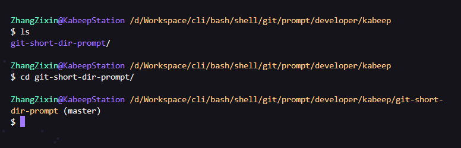
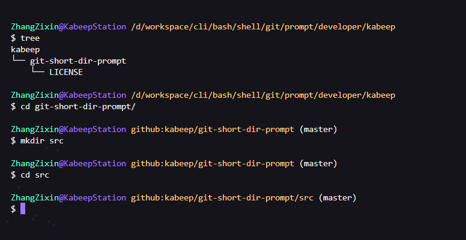

<h1 align="center"> git-short-dir-prompt </h1>
<p align="center">
  <b>A Bash script to simplify Git working directory paths for enhanced efficiency and focus in the command line</b>
</p>

---

<div align="center">


[](CHANGELOG.md)
[](LICENSE)

English | [简体中文](README.zh-CN.md)

</div>

## 📖 Features

`git-short-dir-prompt` is a script designed for the Bash shell environment, based on the concept of [git-prompt.sh](https://github.com/git/git/blob/master/contrib/completion/git-prompt.sh). It displays a concise directory path within Git repositories.

It aims to enhance work efficiency and focus in the command line, especially suitable for developers who need to navigate quickly through complex directory structures.

> It helps you:
>
> - Automatically detect if the current directory is a Git repository, not just initialized
>
> - Hide lengthy working directory paths in Git directories
>
> - Simplify paths to clearly point to the user and GitHub repository address
> 
> - Resolved the issue of case insensitivity on Windows

#### Default Command Line Prompt



#### Simplified Command Line Prompt



## ⚙️ Installation

1. Clone the repository

```shell
git clone https://github.com/kabeep/git-short-dir-prompt.git
```

2. Enter the project directory

```shell
cd git-short-dir-prompt
```

3. Execute the installer

```shell
./install.sh
```

4. Edit `.bash_profile` to call during initialization

```shell
vim ~/.bash_profile

### .bash_profile
# change your username
PS1="$PS1"'username'                    # username
# change your hostname
PS1="$PS1"'@hostname '                  # hostname
```

5. Load `.bash_profile` or Restart Terminal

```shell
source ~/.bash_profile
```

## 🚀 Usage

Once installed and configured, when you enter a Git repository directory, the command line prompt will automatically update to display a simplified directory path.

## 🤝 Contribution

Contributions via Pull Requests or [Issues](https://github.com/kabeep/git-short-dir-prompt/issues) are welcome.

## 📄 License

This project is licensed under the MIT License. See the [LICENSE](LICENSE) file for details.
