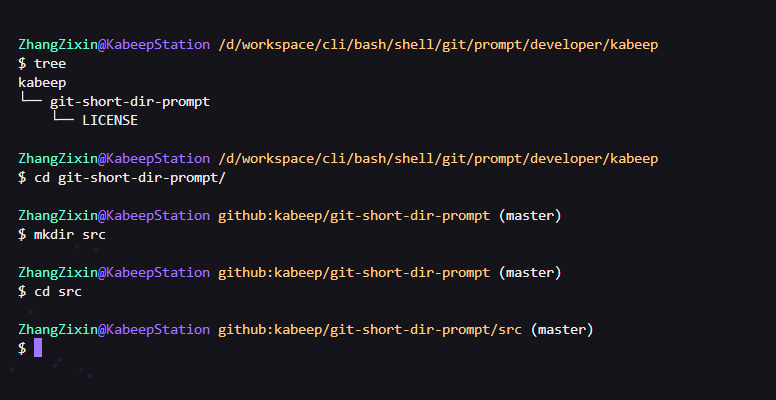

<h1 align="center"> git-short-dir-prompt </h1>
<p align="center">
  <b >简化 Git 工作目录路径的 Bash 脚本，用来提升在命令行中的工作效率和专注度</b>
</p>

---

<div align="center">


[](CHANGELOG.md)
[](LICENSE)

[English](README.md) | 简体中文

</div>

## 📖 简介

`git-short-dir-prompt` 是一个以 [git-prompt.sh](https://github.com/git/git/blob/master/contrib/completion/git-prompt.sh) 的概念为 Bash shell 环境设计的脚本，用于在 Git 仓库中显示简洁的目录路径

它旨在提升命令行中的工作效率和专注度，特别适用于需要在复杂的目录结构中快速导航的开发者

>
> 它能够帮你：
>
> - 自动检测当前目录是否为 Git 仓库，不止初始化
>
> - 在 Git 目录中隐藏冗长的工作目录路径
>
> - 简化路径清晰指向用户与 GitHub 仓库地址
> 
> - 解决了 windows 的大小写不敏感问题

#### 默认的命令行提示符


#### 简化的命令行提示符



## ⚙️ 安装

1. 克隆仓库

```shell
git clone https://github.com/kabeep/git-short-dir-prompt.git
```

2. 编辑 `.bash_profile` 以在初始化中调用

```shell
vim ~/.bash_profile
```

example

```shell
# .bash_profile

# Git Bash Prompt String 1
PS1='\[\033]0;$TITLEPREFIX:$PWD\007\]'  # Set terminal window title to include PWD (Present Working Directory)
PS1="$PS1"'\n'                          # Add a new line to the prompt
PS1="$PS1"'\[\033[32m\]'                # Change text color to green
PS1="$PS1"'your_username'               # representing the username placeholder
PS1="$PS1"'\[\033[35m\]'                # Change text color to purple
PS1="$PS1"'@your_hostname '             # representing the your_hostname placeholder
PS1="$PS1"'\[\033[33m\]'                # Change text color to brownish yellow

# Check if WINELOADERNOEXEC is not set, if not, proceed to configure Git related prompts
if test -z "$WINELOADERNOEXEC"
then
  # Determine the path for Git completions
  GIT_EXEC_PATH="$(git --exec-path 2>/dev/null)"
  COMPLETION_PATH="${GIT_EXEC_PATH%/libexec/git-core}"
  COMPLETION_PATH="${COMPLETION_PATH%/lib/git-core}"
  COMPLETION_PATH="$COMPLETION_PATH/share/git/completion"

  ################### Change $COMPLETION_PATH to your path ####################
  # Check if repo-prompt.sh exists and source it if it does
  if test -f "$COMPLETION_PATH/git-short-dir-prompt.sh"
  then
    . "$COMPLETION_PATH/git-short-dir-prompt.sh"
    PS1="$PS1"'`__git_short_dir_ps1`'  # Add the output from __repo_ps1 function to PS1
  fi
  #############################################################################

  # Check if git-prompt.sh exists and source it if it does
  if test -f "$COMPLETION_PATH/git-prompt.sh"
  then
    . "$COMPLETION_PATH/git-completion.bash"
    . "$COMPLETION_PATH/git-prompt.sh"
    PS1="$PS1"'\[\033[36m\]'  # Change text color to cyan
    PS1="$PS1"'`__git_ps1`'   # Add the output from __git_ps1 function to PS1
  fi
else
  PS1="$PS1"'\w'  # Display the current working directory if WINELOADERNOEXEC is set
fi

PS1="$PS1"'\[\033[0m\]'         # Reset text color to default
PS1="$PS1"'\n'                  # Add a new line
PS1="$PS1"'$ '                  # Finalize the prompt with a dollar sign

# Include other configuration files if they exist
# generated by Git for Windows
test -f ~/.profile && . ~/.profile  # Source the .profile file if it exists
test -f ~/.bashrc && . ~/.bashrc    # Source the .bashrc file if it exists
```

3. 加载 `.bash_profile` / 重启终端

```shell
source ~/.bash_profile
```

## 🚀 使用

一旦安装和配置完成，当你进入一个 Git 仓库目录时，命令行提示符将自动更新以显示简化的目录路径。

## 🤝 贡献

欢迎通过 Pull Requests 或 [Issues](https://github.com/kabeep/git-short-dir-prompt/issues) 来贡献你的想法和代码。

## 📄 许可

本项目采用 MIT 许可证。详情请见 [LICENSE](LICENSE) 文件。
